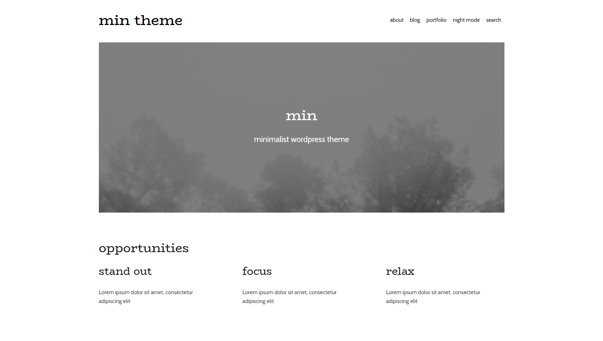

# min - a minimalist, multipurpose theme for wordpress

### Why
I have created this theme to practice my web development skills and gain experience in web development.
This theme is used in production [on my blog](https://everyday.codes).

### Technology used
- Theme framework - underscores
- CI/CD - Docker, gulp

### Installation
Run `npm i`, then `npm run build`. Take `min-dist.zip` file from `/build` and install it
using Wordpress interface.

### Development
For development convenience, Dockerfile and docker-compose files are written.
To watch for theme changes and compile it on the go, run `npm run dev`. 
Then, start docker with `docker-compose up` in the project root and go to http://localhost:8000 . 
Your changes to the theme are propagated immediately.

### Features
- Fully responsive
- Night theme on/off
- Cookies consent banner
- Visual Composer / WooCommerce support
- Highly optimized
- Documented and organized
- SEO friendly

### Wordpress Theme Registry
_Coming soon_

### Contributing
The theme is in active development. If you spot a bug, fell free to submit it to issues, or fix it with a pull request.
The theme is based on [underscores](https://underscores.me/) framework.